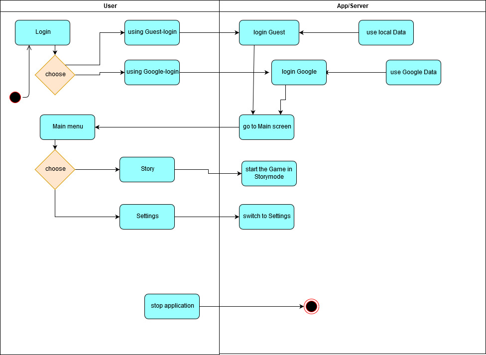
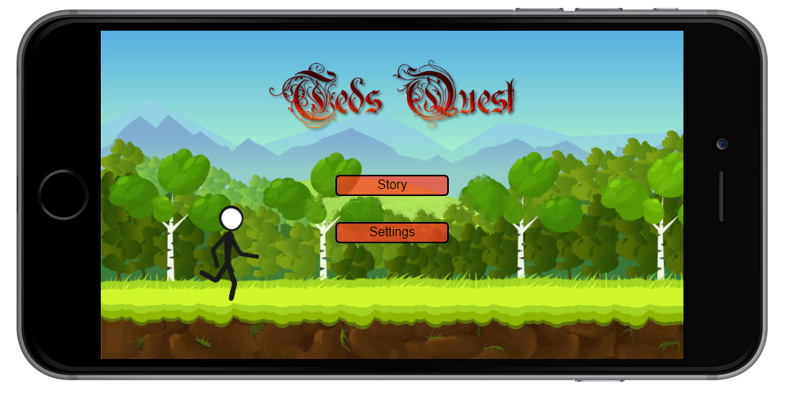
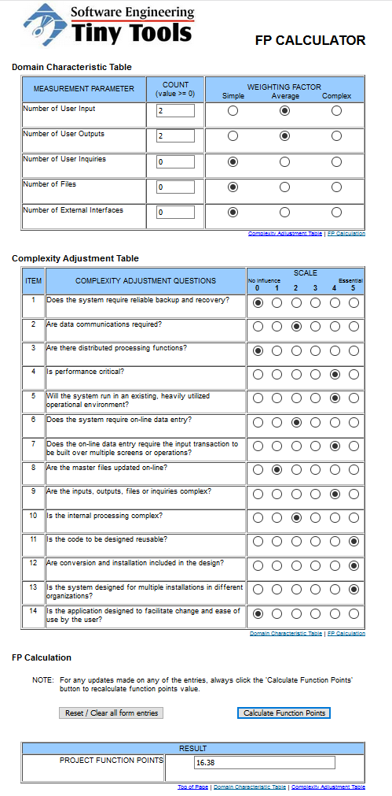

# Hypercasual Game <!-- omit in toc -->

# Use-Case Specification: Mainmenu of Ted's Quest <!-- omit in toc -->

## Table of Contents <!-- omit in toc -->
- [1. Brief Description](#11-brief-description)
- [2. Flow of Events](#2-flow-of-events)
  - [2.1 Basic Flow](#21-basic-flow)
    - [2.1.1 Activity Diagram](#211-activity-diagram)
    - [2.1.2 Mock Up](#212-mock-up)
- [3. Special Requirements](#3-special-requirements)
- [4. Preconditions](#4-preconditions)
- [5. Postconditions](#5-postconditions)
- [6. Extension Points](#6-extension-points)

## Mainmenu

## 1. Brief Description
When starting the application, the user has some choices on what to do next, either starting the game or checking the settings.

The title menu includes a button for each of this functions.
## 2. Flow of Events

### 2.1 Basic Flow

#### 2.1.1 Activity Diagram

#### 2.1.2 Mock Up

## 3. Special Requirements

(n/a)

## 4. Preconditions

(n/a)

## 5. Postconditions

(n/a)

## 6. Function Points

