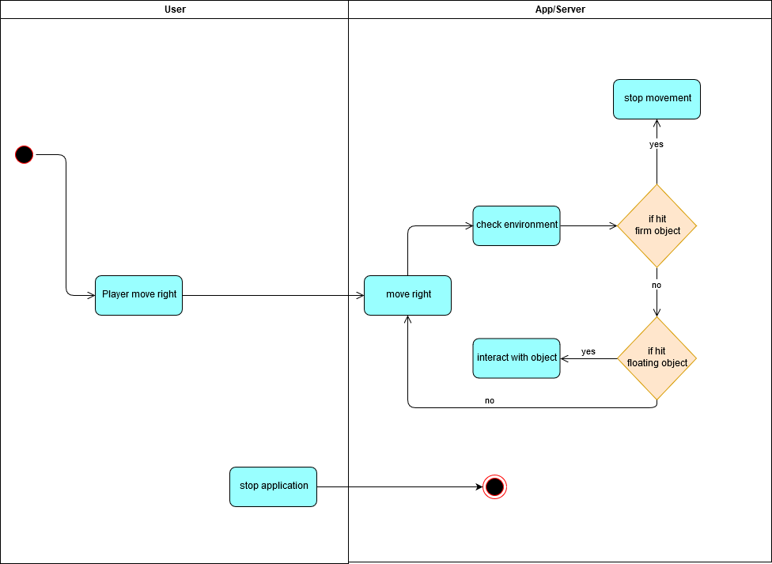
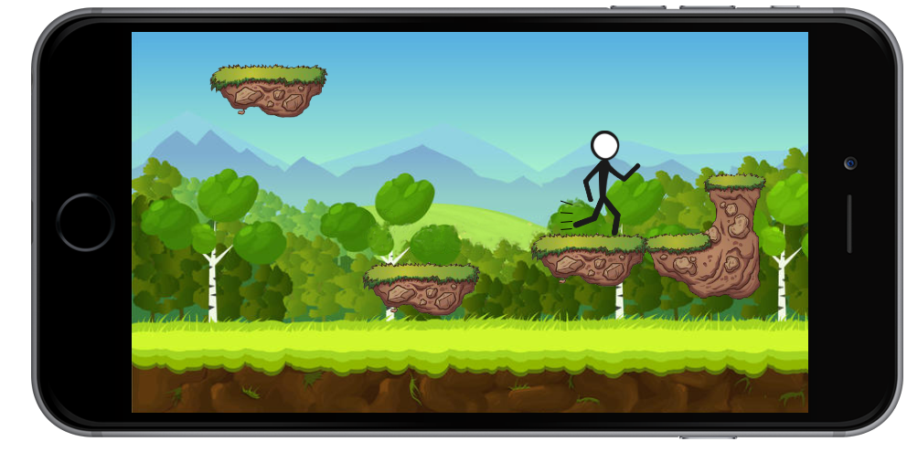
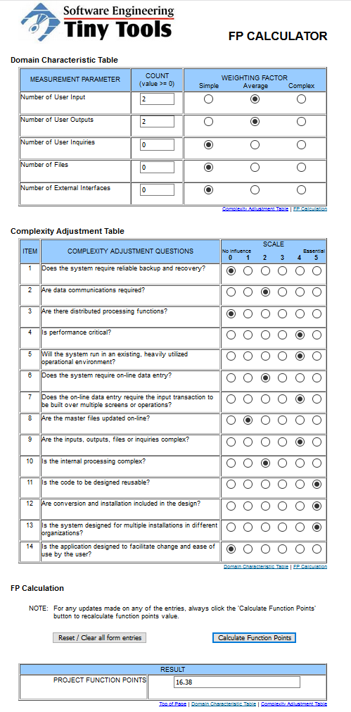

# Hypercasual Game <!-- omit in toc -->

# Use-Case Specification: MoveRight of Ted's Quest <!-- omit in toc -->

## Table of Contents <!-- omit in toc -->
- [1. Brief Description](#11-brief-description)
- [2. Flow of Events](#2-flow-of-events)
  - [2.1 Basic Flow](#21-basic-flow)
    - [2.1.1 Activity Diagram](#211-activity-diagram)
    - [2.1.2 Mock Up](#212-mock-up)
- [3. Special Requirements](#3-special-requirements)
- [4. Preconditions](#4-preconditions)
- [5. Postconditions](#5-postconditions)
- [6. Extension Points](#6-extension-points)

## Settings

## 1. Brief Description
MoveRight is a possible action in the game. You can move right in order to continue further in the level. 
The Stickman you control can also move to the left, this Use-Case is also an Example for it.
This Use-Case is just useable after starting the story in one of the chapters.
## 2. Flow of Events

### 2.1 Basic Flow

#### 2.1.1 Activity Diagram

#### 2.1.2 Mock Up

## 3. Special Requirements

(n/a)

## 4. Preconditions

(n/a)

## 5. Postconditions

(n/a)

## 6. Function Points

