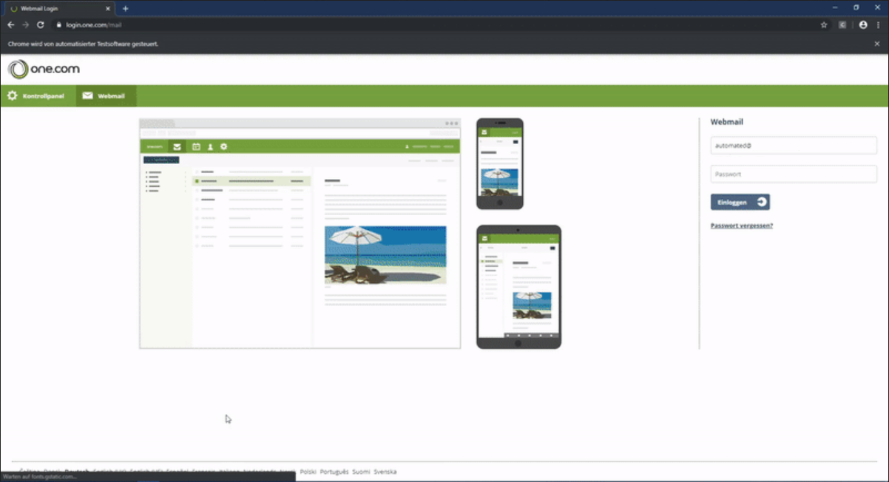

# Hypercasual Game <!-- omit in toc -->

# Use-Case Specification: Open Chrome Browser Website <!-- omit in toc -->

## Table of Contents <!-- omit in toc -->
- [Open Chrome Browser Website](#open-chrome-browser-website)
  - [1.1 Brief Description](#11-brief-description)
- [2. Flow of Events](#2-flow-of-events)
  - [2.1 Basic Flow](#21-basic-flow)
    - [2.1.1 Activity Diagram](#211-activity-diagram)
    - [2.1.2 Mock Up](#212-mock-up)
- [3. Special Requirements](#3-special-requirements)
- [4. Preconditions](#4-preconditions)
- [4.1 Title menu visible](#41-chrome-browser)
- [4.2 Cube powered on](#42-network-connection)
- [5. Postconditions](#5-postconditions)
- [6. Extension Points](#6-extension-points)

## Open Chrome Browser Website

### 1.1 Brief Description
In order to open a website, it is required to use a browser.

The title menu includes a button for this function.
## 2. Flow of Events

### 2.1 Basic Flow

#### 2.1.1 Activity Diagram

#### 2.1.2 Mock Up

## 3. Special Requirements

(n/a)

## 4. Preconditions

## 4.1 Chrome Browser
The Chrome Browser has to be installed on the computer, where the test is running.

## 4.2 Network Connection
The computer has to have network access to the Internet.

## 5. Postconditions

The website one.com is opened in Chrome Browser.

## 6. Extension Points

(n/a)
