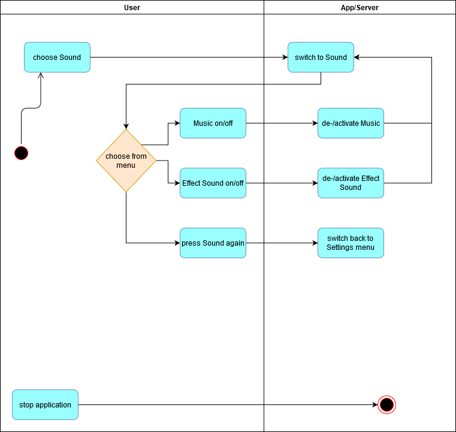
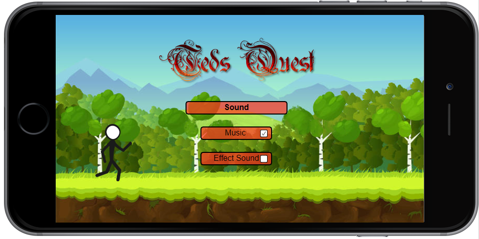

# Hypercasual Game <!-- omit in toc -->

# Use-Case Specification: Soundsettings of Ted's Quest <!-- omit in toc -->

## Table of Contents <!-- omit in toc -->
- [1. Brief Description](#11-brief-description)
- [2. Flow of Events](#2-flow-of-events)
  - [2.1 Basic Flow](#21-basic-flow)
    - [2.1.1 Activity Diagram](#211-activity-diagram)
    - [2.1.2 Mock Up](#212-mock-up)
- [3. Special Requirements](#3-special-requirements)
- [4. Preconditions](#4-preconditions)
- [5. Postconditions](#5-postconditions)
- [6. Extension Points](#6-extension-points)

## Settings

## 1. Brief Description
In the soundsettings menu the user can manage their sounds, if the music or effect sounds should be played. 
The Sound of the choosen type is activated or deactivated through checking or unchecking the checkboxes.

The settings menu includes a button for this function.
## 2. Flow of Events

### 2.1 Basic Flow

#### 2.1.1 Activity Diagram

#### 2.1.2 Mock Up

## 3. Special Requirements

(n/a)

## 4. Preconditions

(n/a)

## 5. Postconditions

(n/a)

## 6. Function Points

(n/a)
